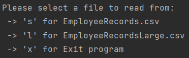
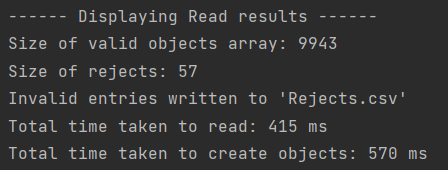
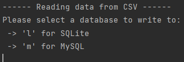
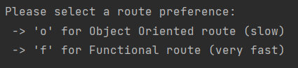
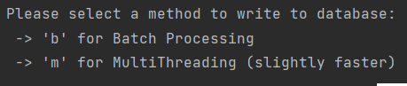
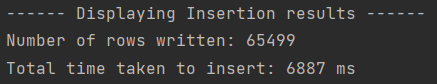
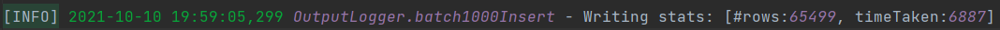

# JavaDataHandlingApp

This is an example of a data migration app. It's purpose is to read data in from a CSV file, sanitise the data and persist it a to a database. The technologies used are as follows:
- IntelliJ - IDE
- Java - Backbone of the whole program, static typed and compiled language for speed.
- JDBC - Java DataBase Connectivity, this was used to allow java to interract with various database types. An advantage of using JDBC over other drivers is the ability to use            many different databases without altering our program too much.
- SQLite - Lightweight file-based database. Fast due to lack of network 'round trips' when interracting. Only limited by CPU IO speed.
- MySQL - More sophisticated database that allows for concurrent access. Needed for multithreaded writing of data.
- Junit - Unit testing.
- Maven - Dependancy manager.
- Log4j - Logging.

## Future improvements:
- A more robust testing suite, the current is somewhat lacking some essential tests for database interaction methods in the JDBCDriver class (left out due to time constraints).
- Implement a front end GUI equiped with many more diverse query types and a table display view for results.
- Add compatability for more databases.
- Potentially parametise the whole programming using column names and number of items in a row as inputs. This would allow for a flexible program capable of dealing with all csv files of similar format.

# How to use

The app is fairly simple, upon running the app the user will be greated with a series of options as to how they would like to process data.

Firstly the user will be prompted to select a file to work with:

If the user selects the smaller file, it will be processed and the results will be displayed on the console.

If the user selects the larger file, they will presented with another menu prompting the user to make a choice of database to persist the data to.

The database will then be innitialed and initialisation results will be displayed. The user will then be asked which programming route they would like to utilise. A choice between an object oriented implementation and a functional approach.

Read results for the chosen method will then be displayed followed by one final prompt for the user. Which style of writing would they like to use, batch processing or multithreading. If the user chooses multithreading, they will be asked how many threads they would like to use.

The database writing results will then be displayed. It will also be logged within the 'app.log' file.

